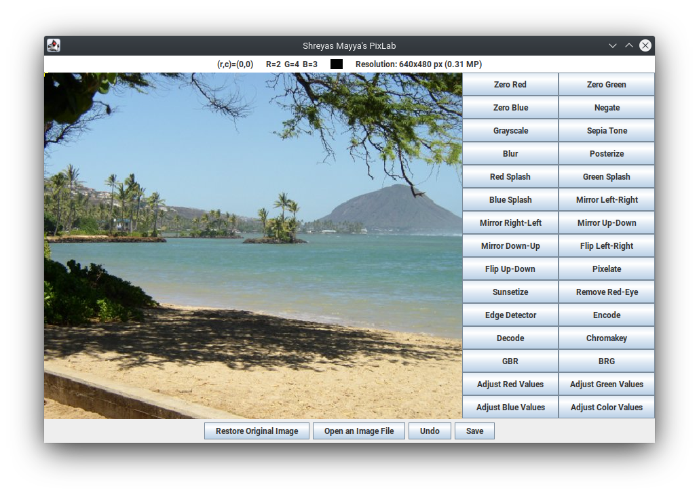

# Shreyas Mayya's PixLab

This is an upgrade of the original PixLab assignment from TJHSST's Foundations of Computer Science course that I completed as a final project for the same course.

Here's what it can do:

* Set all red/green/blue values to zero
* Negate all colors
* Grayscale filter
* Sepia filter
* Blur
* Posterize
* Red/green/blue color splash
* Mirror one half of the image onto another
* Flip the image
* Pixelate
* Sunsetize
* Remove red-eye
* Detect edges
* Encode messages
* Decode encoded messages
* Chroma key compositing
* Rotate 120 degrees clockwise/counter-clockwise on the color wheel
* Adjust color values by a specified percentage

You can also use a handy color-picker to see what the color of a certain pixel is, undo your latest change, view the resolution of your image, remove all edits from an image, and save your edited image.

To run, navigate to `src` and run `javac *.java` followed by `java DriverPix`. PixLab was tested successfully on Java 14, and I expect Java 8 and newer should run  this fine.

Possible future improvements include more cleanly recognizing pixels to change (or not) in the splash, red-eye, encode/decode, edge detection, and chroma key functions.
